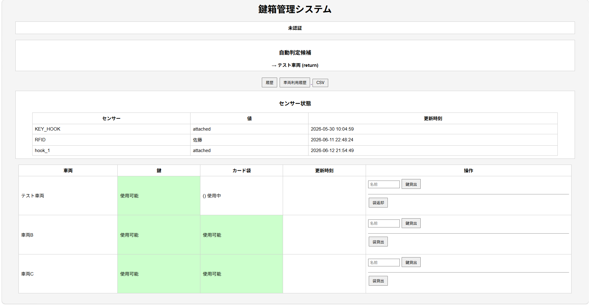
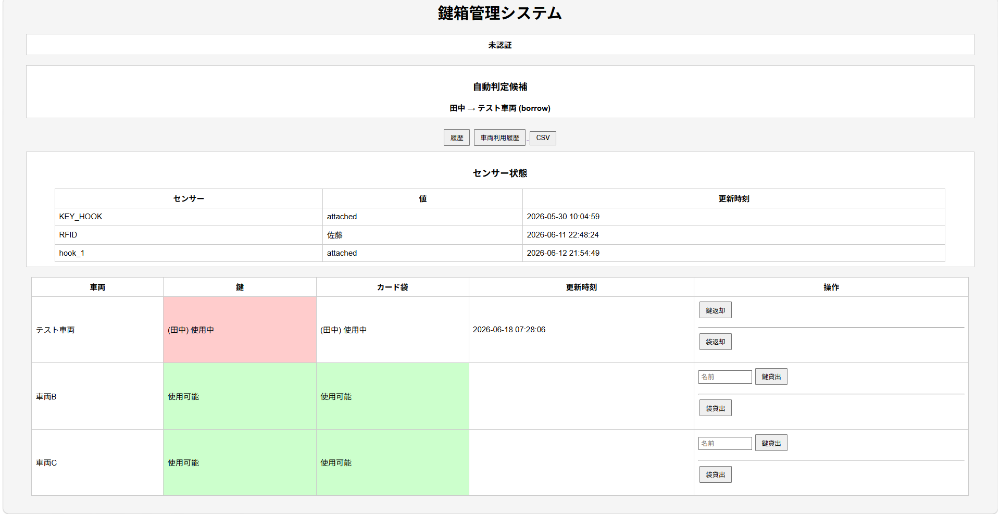
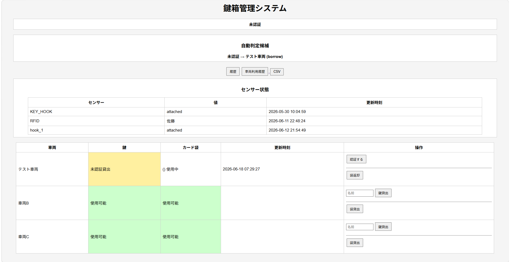
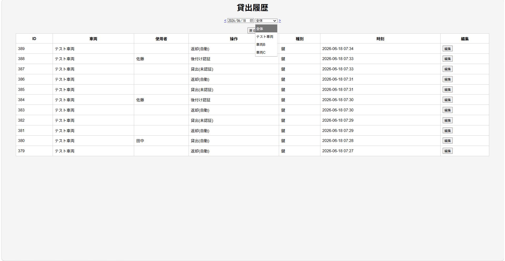
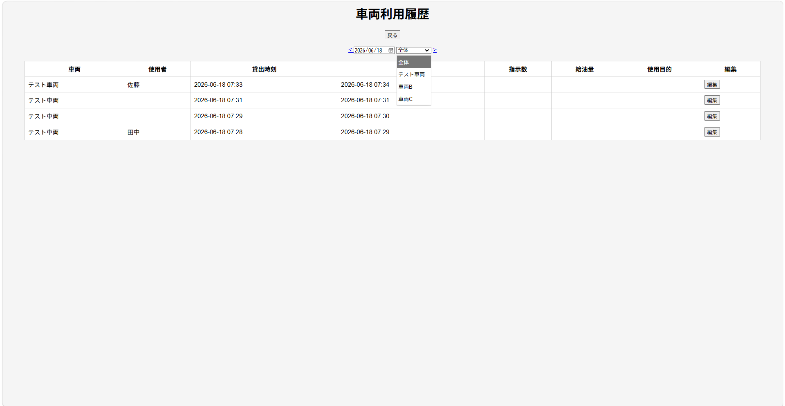

# Vehicle Key Management System

## Overview

RFIDカードとリードスイッチを利用した車両鍵管理システムです。

車両の貸出・返却状況を管理し、利用履歴を記録します。

---

## Features

* RFID認証貸出
* 未認証貸出検知
* 後付け認証
* 鍵返却管理
* 車両利用履歴
* 利用履歴編集
* CSV出力

---

## Screenshots

### Dashboard

### Borrow History

### Vehicle Usage History

### Usage Edit Screen

---

## Hardware

* Raspberry Pi 4
* RC522 RFID Reader
* Reed Switch

---

## Software

* Python
* FastAPI
* SQLite
* Nginx

---

## Project Structure

api_server.py : FastAPIサーバ

rfid_read.py : RFID読み取り

reed_send.py : リードスイッチ監視

init_db.py : DB初期化

templates/dashboard.html : ダッシュボード画面

---

## Future Work

### Version 1.3
* NFCタグ連携
* スマホ入力画面

### Version 1.4
* UI改善
* 現場フィードバック反映

### Version 2.0
* PENDING状態
* OCR入力
* Docker対応

